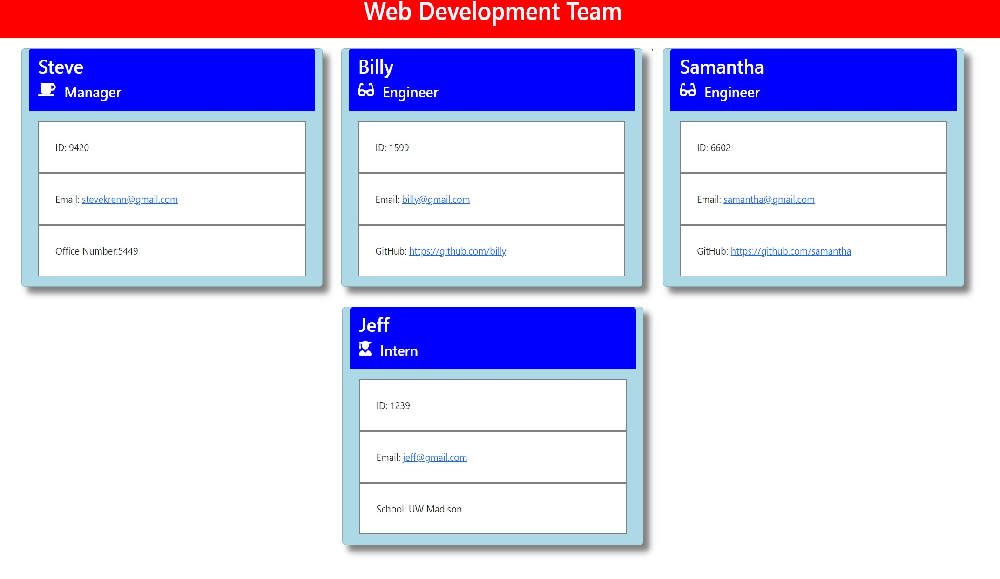

# Team Profile Generator

## Table of Contents
  * [Description](#description)
  * [Technologies](#technologies-used)
  * [Challenges](#challenges)
  * [Future Implementations](#future-implementations)
  * [User Story](#user-story)
  * [Mock Up](#mock-up)
  * [Installation](#installation)
  * [License](#license)

## Video Demonstration
A video demonstration about how this program can be used in the terminal can be found [HERE](https://drive.google.com/file/d/11pYIIHpm6FFOFSF35wmETCHBQBa_8tCm/view)

## Description
Using node.js, quickly enter information about a manager's engineering team directly from the terminal, and have an easy to read html page returned. Keep track of all your teams with at-a-glance information including office numbers, emails, GitHub profiles, etc.

## Technologies Used
* HTML
* CSS
* JavaScript
* [node.js](https://nodejs.org/en/)
* [Inquirer](https://www.npmjs.com/package/inquirer) for question prompts
* [Jest](https://www.npmjs.com/package/jest) for testing

## Challenges
* Working with new technologies such as inquirer and jest
* Properly implementing testing syntax
* Adding multiple discreet parts into a dynamic page
* JavaScript modulation

## Future Implementations
* Better backend/frontend encapsulation. 
* Ability to add more information
* Ability to choose frontend appearance
* Ability for managers to apply notes hidden from frontend page


## User Story

```md
AS A manager
I WANT to generate a webpage that displays my team's basic info
SO THAT I have quick access to their emails and GitHub profiles
```

## Acceptance Criteria

```md
GIVEN a command-line application that accepts user input
WHEN I am prompted for my team members and their information
THEN an HTML file is generated that displays a nicely formatted team roster based on user input
WHEN I click on an email address in the HTML
THEN my default email program opens and populates the TO field of the email with the address
WHEN I click on the GitHub username
THEN that GitHub profile opens in a new tab
WHEN I start the application
THEN I am prompted to enter the team manager’s name, employee ID, email address, and office number
WHEN I enter the team manager’s name, employee ID, email address, and office number
THEN I am presented with a menu with the option to add an engineer or an intern or to finish building my team
WHEN I select the engineer option
THEN I am prompted to enter the engineer’s name, ID, email, and GitHub username, and I am taken back to the menu
WHEN I select the intern option
THEN I am prompted to enter the intern’s name, ID, email, and school, and I am taken back to the menu
WHEN I decide to finish building my team
THEN I exit the application, and the HTML is generated
```

## Mock-up



## Installation
1. Clone repository into local machine
2. Run `npm install` to install dependencies
3. Run `node index.js` to start inputs
4. Your page will be generated in `index.html`

# License
MIT © Krenbot